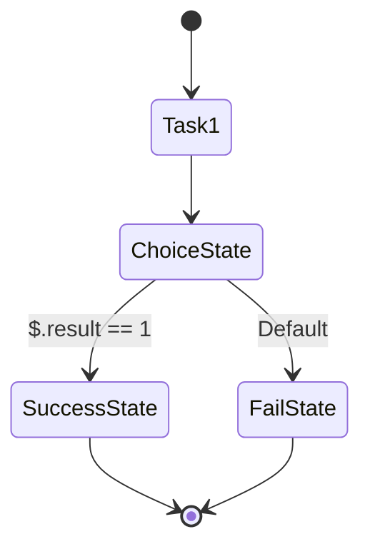

# Step Functions

## Overview

AWS Step Functions is a serverless orchestration service that allows you to coordinate multiple AWS services into serverless workflows, making it easier to build and orchestrate distributed applications. With Step Functions, you can design and run workflows that stitch together services like AWS Lambda, Amazon ECS, and others.

## Definition

AWS Step Functions allows you to build and visualize workflows as state machines. Each step in your workflow is called a "state," and the workflow progresses through these states based on the logic you define.

### Key Components

| **Component**     | **Description**                                              |
| ----------------- | ------------------------------------------------------------ |
| **State**         | A state represents a single step in your workflow.           |
| **State Machine** | A state machine is a collection of states and transitions that define the workflow logic. |
| **Task**          | A task is a state that performs a single unit of work.       |
| **Choice**        | A state that makes decisions based on the input, leading to different branches of execution. |
| **Parallel**      | A state that branches out into multiple parallel states that run simultaneously. |
| **Map**           | A state that iterates over a list of items and applies the same process to each item. |
| **Catch/Retry**   | Mechanisms to handle errors and retry states in case of failures. |
| **Pass**          | A state that passes its input to the output without performing any work, useful for testing or debugging. |

## Uses

AWS Step Functions are primarily used to:

1. **Orchestrate Microservices**: Coordinate multiple AWS services and APIs into workflows, enabling complex processing without manual intervention.
2. **Automate IT and Business Processes**: Create automated workflows for tasks such as data processing, machine learning model training, and more.
3. **Build Resilient Applications**: Implement retry and error handling strategies to build applications that can recover from failures.

## How It Works

1. **State Machine Definition**: You define a state machine in JSON using the Amazon States Language (ASL). The definition specifies the sequence of states and how data flows between them.

2. **Execution**: When you start an execution, Step Functions processes the input data according to the state machine definition. It transitions from one state to the next based on the logic you've defined.

3. **Monitoring and Visualization**: Step Functions provides a graphical interface to visualize and monitor the execution flow in real-time. You can see which states were executed, the path taken, and where errors occurred.

### Example: Simple Workflow

Here's a basic example of a Step Functions workflow:

```json
{
  "StartAt": "Task1",
  "States": {
    "Task1": {
      "Type": "Task",
      "Resource": "arn:aws:lambda:us-east-1:123456789012:function:TaskFunction1",
      "Next": "ChoiceState"
    },
    "ChoiceState": {
      "Type": "Choice",
      "Choices": [
        {
          "Variable": "$.result",
          "NumericEquals": 1,
          "Next": "SuccessState"
        }
      ],
      "Default": "FailState"
    },
    "SuccessState": {
      "Type": "Succeed"
    },
    "FailState": {
      "Type": "Fail"
    }
  }
}
```

### Diagram

Below is a visual representation of the above state machine:



### Real-World Example: ETL Pipeline

In a real-world scenario, you might use Step Functions to orchestrate an Extract, Transform, Load (ETL) pipeline:

1. **Extract**: Trigger a Lambda function to pull data from an S3 bucket.
2. **Transform**: Process the data using a series of Lambda functions or AWS Glue jobs.
3. **Load**: Store the processed data into a data warehouse like Amazon Redshift.

### ETL Pipeline Example

```json
{
  "StartAt": "ExtractData",
  "States": {
    "ExtractData": {
      "Type": "Task",
      "Resource": "arn:aws:lambda:us-east-1:123456789012:function:ExtractFunction",
      "Next": "TransformData"
    },
    "TransformData": {
      "Type": "Task",
      "Resource": "arn:aws:lambda:us-east-1:123456789012:function:TransformFunction",
      "Next": "LoadData"
    },
    "LoadData": {
      "Type": "Task",
      "Resource": "arn:aws:lambda:us-east-1:123456789012:function:LoadFunction",
      "End": true
    }
  }
}
```

## Benefits

1. **Serverless and Fully Managed**: No need to provision or manage servers.
2. **Visual Workflows**: Intuitive graphical interface to design, implement, and monitor workflows.
3. **Built-in Error Handling**: Retry and catch mechanisms to build resilient workflows.
4. **Scalability**: Automatically scales with the complexity of the workflow without manual intervention.

## Conclusion

AWS Step Functions is a powerful tool for orchestrating distributed applications and automating workflows. Its ease of use, combined with AWS's serverless ecosystem, makes it an ideal choice for building scalable, reliable, and complex applications with minimal effort.

---

## References

- [AWS Step Functions Documentation](https://docs.aws.amazon.com/step-functions/index.html)
- [AWS Step Functions Developer Guide](https://docs.aws.amazon.com/step-functions/latest/dg/welcome.html)
